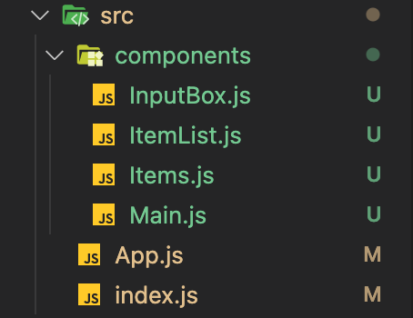

# React로 간단하게 Todo List 만들기

## 프로젝트 생성

CRA로 프로젝트를 생성한다

```bash
npx create-react-app todo
```

## 구현 기획

Todo List의 디렉토리 구조와 구현할 기능을 기획한다.

**기능**

- Item 추가
- Item 수정
- Item 삭제
- Item 완료항목 체크
- 완료된 Item 목록

## 디렉토리 세팅

- components
  - Main.js
  - InputBox.js
  - ItemList.js
  - Items.js


